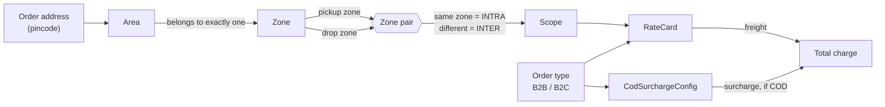

# Last-Mile Delivery Tracker

Logistics platform for creating delivery orders with auto-calculated charges,
assigning agents, and notifying customers at every status change.

Next.js 14 (App Router) · TypeScript · Tailwind CSS · Prisma 6 · PostgreSQL ·
Zod · bcryptjs · jose.

## Getting started

```bash
npm install
cp .env.example .env      # then fill in DATABASE_URL, DIRECT_URL, JWT_SECRET
npm run db:migrate        # apply migrations
npm run db:seed           # seed zones, rate cards, one admin, two agents
npm run dev
```

Generate a `JWT_SECRET` with:

```bash
node -e "console.log(require('crypto').randomBytes(32).toString('hex'))"
```

---

## Configuration model

Pricing is entirely data-driven. No zone, rate or surcharge value appears
anywhere in application code — the tables below are the only source of truth,
and they are edited through the admin UI at `/admin`.



### How the pieces relate

**Zone** — the unit that rates are priced between. A zone has a unique `code`
(`NORTH`) used throughout the rate tables and reports.

**Area** — maps a pincode to **exactly one** zone. This is how a pickup or drop
address finds its zone: the address's pincode is looked up here, and the area's
zone becomes the order's zone. A zone has many areas; an area belongs to one
zone.

> A pincode may **not** appear under two different zones. If it did, zone
> detection would depend on which row happened to be read first, and the same
> address would price differently between requests. The API rejects such a write
> with a 409, and the admin overview reports any that already exist. Two areas
> sharing a pincode *within one zone* is fine — the answer is unambiguous.

**RateCard** — one row per `(orderType, scope, fromZone, toZone)`, which is also
its unique key. It carries a `baseRate` covering the first `baseWeightKg`, and a
`perKgRate` for weight beyond that.

> **Scope is derived, never chosen.** A card within one zone is `INTRA`; a card
> between two different zones is `INTER`. The rate lookup computes scope the same
> way from the order's pickup and drop zones, so a row whose stored scope
> disagreed with its zone pair could never be matched — present in the table,
> invisible in practice. The API derives it, and a CHECK constraint
> (`rate_cards_scope_matches_zone_pair`) enforces it against anything that
> bypasses the API.

**CodSurchargeConfig** — one row per order type, applied on top of freight when
an order is paid cash on delivery. Either a `FIXED` amount or a `PERCENTAGE` of
the freight charge with an optional floor. A row carries only the value its mode
uses; the other column is null, enforced by
`cod_surcharge_mode_matches_value`.

### Coverage: how many rate cards you need

With **N** active zones, every ordered pair of zones needs a card for each order
type:

```
required = orderTypes × N²  =  2 × N²

N = 2 →  8 cards   (2 intra + 2 inter, per order type)
N = 3 → 18 cards
N = 4 → 32 cards
```

Adding one zone to an N-zone grid needs `2 × ((N+1)² − N²)` new cards — eight of
them for a third zone. This is the failure that no single row reveals: the table
looks fine, and the only symptom is an order between the new zone and an old one
that cannot be priced.

`GET /api/admin/config-health` and the `/admin` overview compute this across the
whole table and list every gap. The rate-cards screen can create all missing
combinations in one transaction, with rates the admin supplies.

A gap is either **missing** (no row) or **inactive** (a row exists but is
switched off). Both mean the same thing to a lookup, so both are reported.

---

## Admin API

Every route below is ADMIN-only, enforced twice: middleware gates `/api/admin/*`
on the JWT's role, and each handler re-reads the account so a deactivated or
demoted admin is rejected even while holding a valid token.

| Method | Path | Purpose |
| ------ | ---- | ------- |
| GET / POST | `/api/admin/zones` | List / create zones |
| GET / PATCH / DELETE | `/api/admin/zones/[id]` | Read / update / delete a zone |
| GET / POST | `/api/admin/areas` | List (`?zoneId=`) / create areas |
| GET / PATCH / DELETE | `/api/admin/areas/[id]` | Read / update / delete an area |
| GET / POST | `/api/admin/rate-cards` | List (`?orderType=&scope=`) / create |
| GET / PATCH / DELETE | `/api/admin/rate-cards/[id]` | Read / update rates / delete |
| POST | `/api/admin/rate-cards/bulk` | Create many in one transaction |
| GET / PUT | `/api/admin/cod-surcharges` | List / upsert by order type |
| GET / DELETE | `/api/admin/cod-surcharges/[orderType]` | Read / remove one |
| GET | `/api/admin/config-health` | Coverage gaps and pincode conflicts |

Deletes are refused rather than cascaded when something depends on the row:

- A **zone** referenced by areas, rate cards, agents or orders returns 409 naming
  what is in the way. Deactivate it instead — an inactive zone drops out of
  coverage without disturbing existing orders.
- A **rate card** that priced any order returns 409. Orders snapshot
  `rateCardId` for auditability, and deleting the card would destroy the record
  of how those orders were charged.

---

## Auth API

| Method | Path | Access |
| ------ | ---- | ------ |
| POST | `/api/auth/register` | public (creates a CUSTOMER) |
| POST | `/api/auth/login` | public |
| POST | `/api/auth/logout` | public |
| GET | `/api/me` | any signed-in role |
| GET | `/api/agent/ping` | AGENT, ADMIN |
| GET | `/api/admin/ping` | ADMIN |

```bash
curl -i -c jar.txt -X POST http://localhost:3000/api/auth/register \
  -H 'Content-Type: application/json' \
  -d '{"name":"Test Customer","email":"you@example.com","password":"Sup3rSecret!"}'

curl -b jar.txt http://localhost:3000/api/me
```

Sessions are HS256 JWTs in an httpOnly, SameSite=Lax cookie. `src/middleware.ts`
gates routes by role on the Edge runtime; route handlers re-verify through
`src/lib/auth/guard.ts`.

---

## Notes

`order_status_history` is append-only and enforced by a Postgres trigger —
UPDATE, DELETE and TRUNCATE all raise. Corrections are recorded as new rows.

See [CLAUDE.md](CLAUDE.md) for conventions and the charge-calculation formula.
