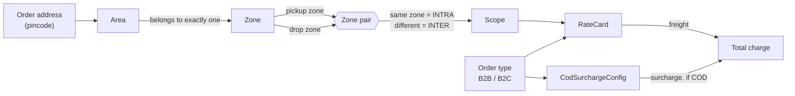
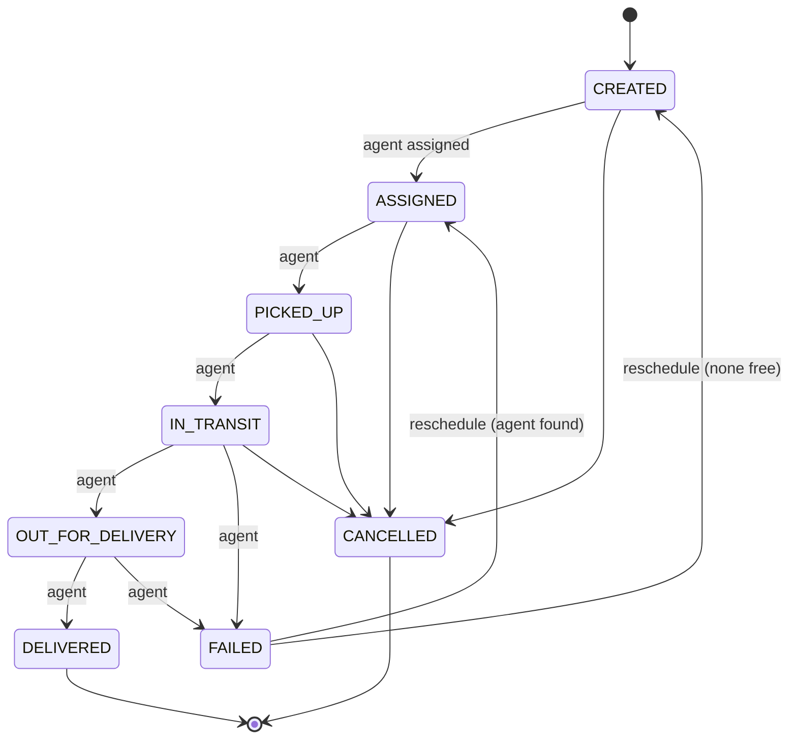

# Last-Mile Delivery Tracker

Logistics platform for creating delivery orders with auto-calculated charges,
assigning agents, and notifying customers at every status change.

Next.js 14 (App Router) · TypeScript · Tailwind CSS · Prisma 6 · PostgreSQL ·
Zod · bcryptjs · jose.

## Contents

- [Getting started](#getting-started) · [Environment variables](#environment-variables)
- [Database schema](#database-schema) · [Configuration model](#configuration-model)
- [Rate engine](#rate-engine) — the charge calculation
- [API reference](#api-conventions) — [auth](#auth-api), [orders](#order-api), [admin](#admin-api), [lifecycle](#lifecycle-api)
- [Status lifecycle](#status-lifecycle) · [Orders and assignment](#orders-and-assignment)
- [Notifications](#notifications-1) · [Design system](#design-system) · [Motion](#motion)
- [System design write-up](SYSTEM_DESIGN.md)

---

## Getting started

### Prerequisites

| Requirement | Notes |
| ----------- | ----- |
| Node.js 18.17+ | Developed on Node 22/25; Next 14 needs ≥ 18.17 |
| A PostgreSQL database | Neon's free tier works; any Postgres 13+ does |
| A Resend API key | Optional — without it email is logged, not sent |

### Install and run

```bash
git clone https://github.com/devaskswhy/Last-Mile_DeliveryTracker-D7V-.git
cd Last-Mile_DeliveryTracker-D7V-

npm install                # postinstall runs `prisma generate`
cp .env.example .env       # then fill it in — see the table below

npm run db:migrate         # apply migrations (uses DIRECT_URL)
npm run db:seed            # zones, areas, rate cards, 1 admin, 2 agents
npm run dev                # http://localhost:3000
```

The seed **requires** `SEED_ADMIN_PASSWORD` and `SEED_AGENT_PASSWORD` and fails
loudly without them — there are no fallback passwords, so a working credential
can never sit in the repository. Re-running the seed rewrites those accounts'
password hashes, which is also how you rotate them.

### Commands

```bash
npm run dev          # dev server
npm run build        # production build
npm start            # serve the production build
npm test             # Vitest — 107 unit tests, no database needed
npm run test:watch   # Vitest in watch mode
npm run db:migrate   # prisma migrate dev
npm run db:deploy    # prisma migrate deploy (CI / production)
npm run db:seed      # idempotent seed
npm run db:studio    # Prisma Studio
```

### Environment variables

Every variable in `.env.example`. `.env` is gitignored and must never be
committed.

| Variable | Required | Purpose |
| -------- | :------: | ------- |
| `DATABASE_URL` | **yes** | Pooled Postgres connection, used at runtime. On Neon this is the host **with** `-pooler`. |
| `DIRECT_URL` | **yes** | Unpooled connection, used by Prisma Migrate. Same host **without** `-pooler` — migrations need a session-mode connection PgBouncer cannot give. |
| `JWT_SECRET` | **yes** | HS256 signing key for session tokens. Minimum 32 characters; the app refuses to boot below that. |
| `JWT_EXPIRES_IN` | no | Session lifetime in seconds. Default `604800` (7 days). |
| `AUTH_COOKIE_NAME` | no | Session cookie name. Default `lm_session`. |
| `SEED_ADMIN_EMAIL` | no | Default `admin@lastmile.local`. |
| `SEED_ADMIN_PASSWORD` | seed only | Required by `npm run db:seed`. No fallback. |
| `SEED_AGENT_PASSWORD` | seed only | Required by `npm run db:seed`. No fallback. |
| `RESEND_API_KEY` | no | Enables real email. Without it the channel reports itself unconfigured and logs instead of sending. |
| `EMAIL_FROM_ADDRESS` | no | Sender. Use `onboarding@resend.dev` until you verify a domain. |
| `EMAIL_FROM_NAME` | no | Sender display name. |
| `NEXT_PUBLIC_APP_URL` | no | Base URL for tracking links in emails. **Set this in production** or emailed links point at localhost. |

Generate a secret with:

```bash
node -e "console.log(require('crypto').randomBytes(32).toString('hex'))"
```

---

## Database schema

`prisma/schema.prisma` is the single source of truth. Tables are `snake_case`
via `@@map`; models stay `PascalCase` and fields `camelCase`. Money and weights
are `Decimal`, never `Float`.

| Model | Purpose |
| ----- | ------- |
| **User** | One row per person. `role` is `CUSTOMER \| AGENT \| ADMIN`. `isActive` allows deactivation without deletion, so an ex-agent's orders keep their actor references. |
| **Zone** | The unit rate cards are priced between. Unique `code` (`NORTH`) used throughout the rate tables. |
| **Area** | Maps a `pincode` to exactly one Zone. This is how an address finds its zone. Unique on `(zoneId, name)`, indexed on `pincode`. |
| **RateCard** | Pricing for one `(orderType, scope, fromZone, toZone)` — also its unique key. Carries `baseRate` covering the first `baseWeightKg`, plus `perKgRate` beyond it. |
| **CodSurchargeConfig** | One row per order type (`orderType` is unique). `FIXED` amount or `PERCENTAGE` of freight with an optional `minAmount` floor. |
| **Agent** | Delivery-agent profile, 1-1 with a User. Holds `availability`, `currentZoneId`, and `currentLat/Lng` for a future dispatcher. |
| **Order** | The shipment. Carries both addresses, dimensions, all three weights, the resolved zones, and a **snapshot** of every charge plus the `rateCardId` used — so a later rate change never rewrites history. |
| **DeliveryAttempt** | One scheduled attempt. Attempt 1 opens with the order; a failure closes it with a reason and rescheduling opens the next. Mutable, because it records the *plan*. |
| **OrderStatusHistory** | **Append-only.** Every status change with actor, role, timestamp and note. A Postgres trigger rejects UPDATE, DELETE and TRUNCATE. |

Four migrations, applied in order:

1. `init` — all tables and enums
2. `order_status_history_append_only` — the audit trigger
3. `config_integrity_constraints` — CHECK constraints on rate cards and COD rows
4. `delivery_attempts` — the attempt table

---

## API conventions

Every route handler answers in one envelope, so clients parse one shape:

```jsonc
// success
{ "ok": true, "data": { /* ... */ } }

// failure
{ "ok": false, "error": { "message": "…", "details": { /* optional */ } } }
```

Validation failures return `422` with per-field messages:

```jsonc
{ "ok": false, "error": { "message": "Validation failed",
  "details": { "email": ["Enter a valid email address"] } } }
```

**Auth** is an HS256 JWT in an httpOnly, SameSite=Lax cookie. `src/middleware.ts`
gates routes by role on the Edge runtime; every handler then re-verifies the
cookie through `src/lib/auth/guard.ts` rather than trusting the `x-user-id`
header middleware forwards. Anything sensitive uses `requireActiveUser()`, which
re-reads the account — a JWT keeps asserting its role until it expires.

| Status | Meaning |
| ------ | ------- |
| `401` | Not signed in, or the account is no longer active |
| `403` | Signed in, wrong role — or an agent touching another agent's order |
| `409` | Conflict: stale quote, duplicate, closed order, no agent available |
| `422` | Validation failed, or a domain rule rejected the request |

---

## Configuration model

Pricing is entirely data-driven. No zone, rate or surcharge value appears
anywhere in application code — the tables below are the only source of truth,
and they are edited through the admin UI at `/admin`.



### How the pieces relate

**Zone** — the unit that rates are priced between. A zone has a unique `code`
(`NORTH`) used throughout the rate tables and reports.

**Area** — maps a pincode to **exactly one** zone. This is how a pickup or drop
address finds its zone: the address's pincode is looked up here, and the area's
zone becomes the order's zone. A zone has many areas; an area belongs to one
zone.

> A pincode may **not** appear under two different zones. If it did, zone
> detection would depend on which row happened to be read first, and the same
> address would price differently between requests. The API rejects such a write
> with a 409, and the admin overview reports any that already exist. Two areas
> sharing a pincode *within one zone* is fine — the answer is unambiguous.

**RateCard** — one row per `(orderType, scope, fromZone, toZone)`, which is also
its unique key. It carries a `baseRate` covering the first `baseWeightKg`, and a
`perKgRate` for weight beyond that.

> **Scope is derived, never chosen.** A card within one zone is `INTRA`; a card
> between two different zones is `INTER`. The rate lookup computes scope the same
> way from the order's pickup and drop zones, so a row whose stored scope
> disagreed with its zone pair could never be matched — present in the table,
> invisible in practice. The API derives it, and a CHECK constraint
> (`rate_cards_scope_matches_zone_pair`) enforces it against anything that
> bypasses the API.

**CodSurchargeConfig** — one row per order type, applied on top of freight when
an order is paid cash on delivery. Either a `FIXED` amount or a `PERCENTAGE` of
the freight charge with an optional floor. A row carries only the value its mode
uses; the other column is null, enforced by
`cod_surcharge_mode_matches_value`.

### Coverage: how many rate cards you need

With **N** active zones, every ordered pair of zones needs a card for each order
type:

```
required = orderTypes × N²  =  2 × N²

N = 2 →  8 cards   (2 intra + 2 inter, per order type)
N = 3 → 18 cards
N = 4 → 32 cards
```

Adding one zone to an N-zone grid needs `2 × ((N+1)² − N²)` new cards — eight of
them for a third zone. This is the failure that no single row reveals: the table
looks fine, and the only symptom is an order between the new zone and an old one
that cannot be priced.

`GET /api/admin/config-health` and the `/admin` overview compute this across the
whole table and list every gap. The rate-cards screen can create all missing
combinations in one transaction, with rates the admin supplies.

A gap is either **missing** (no row) or **inactive** (a row exists but is
switched off). Both mean the same thing to a lookup, so both are reported.

---

## Rate engine

`src/lib/rate-engine/` prices a shipment. The calculation itself is a **pure,
synchronous function** — same inputs, same output, no I/O — so it is tested
against object literals with no database and no mocking library:

```ts
import { calculateRate, loadRateConfig } from "@/lib/rate-engine";

const config = await loadRateConfig(pickupPincode, dropPincode, orderType); // I/O
const quote = calculateRate(input, config);                                 // pure
```

`loadRateConfig` is the only part that touches Prisma, and it is imported
separately so a consumer that already holds the configuration never pulls the
database in behind it.

### The formula

```
volumetricWeight = (L × B × H) / volumetricDivisor        # divisor default 5000
chargeableWeight = max(actualWeight, volumetricWeight)
billedExcessKg   = ceil(max(0, chargeableWeight − baseWeightKg))
baseCharge       = baseRate + perKgRate × billedExcessKg
codSurcharge     = FIXED ? amount : max(minAmount, baseCharge × percentage / 100)
totalCharge      = baseCharge + codSurcharge
```

### Why the arithmetic is integer

Every quantity is a `bigint` count of its smallest unit — money in minor units
(2 dp), weight in grams (3 dp), dimensions in hundredths of a centimetre.
Nothing uses `number`.

The reason is `ceil`. A shipment entered as a round 2 kg against a 1 kg base
slab should bill exactly one excess kilogram, but in binary floating point
`2.0 − 1.0` can land on `1.0000000000000002`, and `Math.ceil` then bills two —
overcharging a whole per-kg rate on an input that looked perfectly round.
Integers make that boundary exact by construction rather than by luck. Values
cross the module boundary as **decimal strings**, so they stay exact from the
database to the JSON response.

### Failure is typed, never a default

The engine throws `RateEngineError` with a stable `code`. Nothing falls back to
a default — in particular a missing COD rule does **not** become a zero
surcharge, because a quote that silently under-charges is worse than one that
refuses.

| Code | Meaning |
| ---- | ------- |
| `PICKUP_AREA_NOT_FOUND` / `DROP_AREA_NOT_FOUND` | Pincode maps to no active area |
| `PICKUP_ZONE_INACTIVE` / `DROP_ZONE_INACTIVE` | Known address, zone not currently served |
| `AMBIGUOUS_PICKUP_PINCODE` / `AMBIGUOUS_DROP_PINCODE` | Pincode spans two zones — refuses to guess |
| `RATE_CARD_NOT_FOUND` | No card for that order type and zone pair |
| `RATE_CARD_INACTIVE` | A card exists but is switched off |
| `COD_SURCHARGE_NOT_CONFIGURED` / `COD_SURCHARGE_INACTIVE` | COD asked for with no usable rule |
| `COD_SURCHARGE_MISCONFIGURED` | Stored row lacks the value its mode needs |
| `INVALID_MEASUREMENT` | Dimension or weight absent, unparseable, or not positive |

Rate-card lookup is **directional**: `NORTH→SOUTH` is not assumed to price
`SOUTH→NORTH`. Falling back to the reverse card would be a pricing decision the
engine is not entitled to make.

### Quote endpoint

`POST /api/orders/quote` — any signed-in role. Read-only: it creates no order
and no status history, so the order form can call it on every keystroke.

```bash
curl -b jar.txt -X POST http://localhost:3000/api/orders/quote \
  -H 'Content-Type: application/json' \
  -d '{"pickupPincode":"110085","dropPincode":"110017","lengthCm":"50","breadthCm":"50","heightCm":"50","actualWeightKg":"2","orderType":"B2C","paymentType":"COD"}'
```

Returns the full breakdown — both zones with the area each pincode resolved
through, all three weights and which one set the chargeable figure, the rate
card used, an itemised freight derivation, and how the COD surcharge was
computed — enough to render a real quote rather than just a total.

Errors carry their `code` in `error.details`. An unresolvable address answers
**422** (the customer can fix it); a configuration gap answers **409** (only an
admin can), so the frontend can say "we cannot price this route yet" instead of
blaming the address.

### Tests

```bash
npm test          # vitest run
npm run test:watch
```

---

## Admin API

Every route below is ADMIN-only, enforced twice: middleware gates `/api/admin/*`
on the JWT's role, and each handler re-reads the account so a deactivated or
demoted admin is rejected even while holding a valid token.

| Method | Path | Purpose |
| ------ | ---- | ------- |
| GET / POST | `/api/admin/zones` | List / create zones |
| GET / PATCH / DELETE | `/api/admin/zones/[id]` | Read / update / delete a zone |
| GET / POST | `/api/admin/areas` | List (`?zoneId=`) / create areas |
| GET / PATCH / DELETE | `/api/admin/areas/[id]` | Read / update / delete an area |
| GET / POST | `/api/admin/rate-cards` | List (`?orderType=&scope=`) / create |
| GET / PATCH / DELETE | `/api/admin/rate-cards/[id]` | Read / update rates / delete |
| POST | `/api/admin/rate-cards/bulk` | Create many in one transaction |
| GET / PUT | `/api/admin/cod-surcharges` | List / upsert by order type |
| GET / DELETE | `/api/admin/cod-surcharges/[orderType]` | Read / remove one |
| GET | `/api/admin/config-health` | Coverage gaps and pincode conflicts |

Deletes are refused rather than cascaded when something depends on the row:

- A **zone** referenced by areas, rate cards, agents or orders returns 409 naming
  what is in the way. Deactivate it instead — an inactive zone drops out of
  coverage without disturbing existing orders.
- A **rate card** that priced any order returns 409. Orders snapshot
  `rateCardId` for auditability, and deleting the card would destroy the record
  of how those orders were charged.

---

## Auth API

| Method | Path | Access |
| ------ | ---- | ------ |
| POST | `/api/auth/register` | public (creates a CUSTOMER) |
| POST | `/api/auth/login` | public |
| POST | `/api/auth/logout` | public |
| GET | `/api/me` | any signed-in role |
| GET | `/api/agent/ping` | AGENT, ADMIN |
| GET | `/api/admin/ping` | ADMIN |

```bash
curl -i -c jar.txt -X POST http://localhost:3000/api/auth/register \
  -H 'Content-Type: application/json' \
  -d '{"name":"Test Customer","email":"you@example.com","password":"Sup3rSecret!"}'

curl -b jar.txt http://localhost:3000/api/me
```

Sessions are HS256 JWTs in an httpOnly, SameSite=Lax cookie. `src/middleware.ts`
gates routes by role on the Edge runtime; route handlers re-verify through
`src/lib/auth/guard.ts`.

### Request and response shapes

<details>
<summary><code>POST /api/auth/register</code> — public, creates a CUSTOMER</summary>

```jsonc
// request
{ "name": "Priya Nair", "email": "priya@example.com",
  "password": "at-least-8-chars", "phone": "+91 98765 43210" }   // phone optional

// 201 — sets the session cookie
{ "ok": true, "data": { "user": { "id": "…", "email": "…", "name": "…", "role": "CUSTOMER" } } }
// 409 if the email is taken
```
</details>

<details>
<summary><code>POST /api/orders/quote</code> — any signed-in role, read-only</summary>

```jsonc
// request
{ "pickupPincode": "110085", "dropPincode": "110017",
  "lengthCm": "40", "breadthCm": "30", "heightCm": "25",
  "actualWeightKg": "4", "orderType": "B2C", "paymentType": "COD" }

// 200 — every figure the charge was built from
{ "ok": true, "data": { "quote": {
  "pickupZone": { "id": "…", "code": "NORTH", "name": "North Zone",
                  "resolvedArea": { "id": "…", "name": "Rohini", "pincode": "110085" } },
  "dropZone":   { "code": "SOUTH", "…": "…" },
  "scope": "INTER",
  "actualWeight": "4.000", "volumetricWeight": "6.000",
  "chargeableWeight": "6.000", "chargeableWeightBasis": "VOLUMETRIC",
  "volumetricDivisor": 5000,
  "rateCardUsed": { "id": "…", "baseRate": "70", "baseWeightKg": "1", "perKgRate": "25" },
  "freightBreakdown": { "baseRate": "70.00", "baseWeightKg": "1.000",
                        "excessWeightKg": "5.000", "billedExcessKg": 5,
                        "perKgRate": "25.00", "excessCharge": "125.00" },
  "codBreakdown": { "mode": "FIXED", "amount": "30.00" },
  "baseCharge": "195.00", "codSurcharge": "30.00", "totalCharge": "225.00"
} } }
```

All money and weight values are **decimal strings**, never JSON numbers.
Errors carry a stable `code` — see the [failure table](#failure-is-typed-never-a-default).
</details>

<details>
<summary><code>POST /api/orders</code> — CUSTOMER (own) or ADMIN (on behalf)</summary>

```jsonc
// request
{ "customerId": "…",                       // ADMIN only; ignored for a CUSTOMER
  "pickup": { "contactName": "Sender Name", "phone": "+91 90000 00001",
              "addressLine1": "12 Test Street", "addressLine2": null,
              "city": "Delhi", "pincode": "110085" },
  "drop":   { "…": "same shape" },
  "lengthCm": "40", "breadthCm": "30", "heightCm": "25", "actualWeightKg": "4",
  "orderType": "B2C", "paymentType": "COD",
  "codAmount": "1500.00",                  // required iff paymentType is COD
  "notes": "optional",
  "acknowledgedTotal": "225.00" }          // REQUIRED — the total you were shown

// 201
{ "ok": true, "data": { "orderId": "…", "orderNumber": "LM-20260820-5ZYAXS",
  "quote": { /* as above */ },
  "assignment": { "assigned": true, "agentName": "Asha Rane", "employeeCode": "AGT-001" } } }
// or  "assignment": { "assigned": false, "reason": "No agent is available in the pickup zone" }

// 409 QUOTE_STALE — the price changed; the fresh quote is attached
```

`acknowledgedTotal` is never used *as* the price. The server recomputes with the
same `calculateRate()` the quote endpoint uses and refuses on any disagreement,
so a tampered payload cannot set its own total.
</details>

<details>
<summary><code>POST /api/agent/orders/[id]/status</code> — AGENT, own orders only</summary>

```jsonc
// request
{ "status": "FAILED", "note": "Nobody at the address; building locked" }

// 200
{ "ok": true, "data": { "orderId": "…", "orderNumber": "…",
  "previousStatus": "OUT_FOR_DELIVERY", "status": "FAILED",
  "nextStatuses": [], "notified": true } }

// 403 NOT_YOUR_ORDER · 422 INVALID_TRANSITION · 409 SAME_STATUS / ORDER_CLOSED
```
</details>

<details>
<summary><code>GET /api/orders/[id]/tracking</code> — owner, assigned agent, or ADMIN</summary>

```jsonc
{ "ok": true, "data": { "tracking": {
  "orderNumber": "…", "currentStatus": "ASSIGNED",
  "isClosed": false, "canReschedule": false,
  "route": { "pickup": { "city": "Delhi", "pincode": "110085", "zone": "NORTH" },
             "drop":   { "…": "…" } },
  "attempts": [ { "attemptNumber": 1, "status": "FAILED",
                  "scheduledFor": null, "failureReason": "Nobody home",
                  "agent": { "name": "Asha Rane", "employeeCode": "AGT-001" } } ],
  "timeline": [ { "id": "…", "fromStatus": null, "status": "CREATED",
                  "note": "Created by the customer", "at": "2026-08-20T05:21:18.887Z",
                  "actor": { "name": "…", "role": "CUSTOMER" } } ]
} } }
```

`timeline` is every `order_status_history` row in order — the whole trail, not a
summary.
</details>

<details>
<summary><code>PATCH /api/agent/availability</code> — the signed-in agent's own status</summary>

```jsonc
// request
{ "availability": "BUSY" }        // AVAILABLE | BUSY | OFFLINE

// 200 — the active count is returned so the UI can say what this did not do
{ "ok": true, "data": { "availability": "BUSY", "activeOrderCount": 6 } }
```

Availability governs auto-assignment only. Going off shift never hands back work
already assigned.
</details>

---

## Orders and assignment

### Creating an order

Two entry points, one code path: `/orders/new` for a customer, `/admin/orders/new`
for an admin acting on a customer's behalf. Both call `POST /api/orders/quote`
live, render the itemised charge, and require an explicit confirmation step.

The quote is bound to the exact inputs that produced it. Editing any field that
affects the price clears it, so the confirm button can never submit a total the
customer is no longer looking at.

> **Charges are never accepted from the client.** `POST /api/orders` recomputes
> the price server-side with the *same* `calculateRate` the quote endpoint uses.
> The one figure the client sends is `acknowledgedTotal` — required, and used
> only as a claim to verify. If it disagrees with the recomputed price the
> request is refused with `409 QUOTE_STALE` and the fresh quote attached, so a
> rate card edited between quote and confirm cannot silently change what the
> customer agreed to pay, and a tampered payload cannot set its own total.

A `CUSTOMER` may only create their own orders; any `customerId` in their payload
is ignored rather than trusted. An `ADMIN` must name the customer. Agents cannot
create orders at all.

Creation is one transaction: the `Order` row, its `CREATED` history entry, and —
when an agent is found — the assignment and its `ASSIGNED` entry.

### Auto-assignment: fewest active orders

Given an order's pickup zone, the policy considers agents whose `currentZoneId`
is that zone, whose `availability` is `AVAILABLE`, and whose user account is
active. Among those it picks the one with the fewest orders in a status that
still needs work (`ASSIGNED`, `PICKED_UP`, `IN_TRANSIT`, `OUT_FOR_DELIVERY`).
Ties break on `employeeCode` so the same inputs always give the same agent.

**Why load balancing rather than nearest by lat/lng**, given the schema carries
`currentLat` / `currentLng`:

1. **The data is always true.** An active-order count is derived from the orders
   table and cannot be stale. Coordinates are nullable and only as fresh as the
   last device check-in — `lastLocationAt` exists precisely because they go
   stale. Assigning on a stale position fails silently: the dispatch looks
   reasonable and the parcel is simply late.
2. **Straight-line distance is not travel distance.** Great-circle metres ignore
   rivers, one-way systems, and an agent already heading the other way.
3. **Proximity alone overloads people.** The closest agent to a busy catchment is
   closest to *every* order in it. Balancing on load is self-correcting: whoever
   takes an order becomes less eligible for the next.

Zone membership already supplies the geographic constraint, so distance would be
refining a choice that is geographically sound to begin with. The coordinates
stay in the schema for a future dispatcher with a real routing service.

`selectAgent()` is a pure function, tested exhaustively without a database.

### When nobody is available

The order is created **unassigned**: status `CREATED`, no agent, and a history
note recording why. It appears in the admin orders screen under a banner
counting how many are waiting. An admin can then assign manually or re-run
auto-assignment on demand once someone frees up.

### Assignment API

`POST /api/admin/orders/[id]/assign` — ADMIN only.

```jsonc
{ "mode": "MANUAL", "agentId": "..." }   // explicit choice
{ "mode": "AUTO" }                        // re-run the policy
```

Manual assignment deliberately ignores availability and zone — that is what an
override is for, and a dispatcher looking at a real situation knows things the
policy does not. The one thing it refuses is a deactivated account.

| Code | Status | Meaning |
| ---- | ------ | ------- |
| `ORDER_NOT_FOUND` / `AGENT_NOT_FOUND` | 404 | No such record |
| `ORDER_TERMINAL` | 409 | Delivered, cancelled or failed — the work is over |
| `ALREADY_ASSIGNED` | 409 | Already that agent; refused so the trail gains no empty row |
| `NO_AGENT_AVAILABLE` | 409 | Auto-assignment found nobody eligible |
| `AGENT_INACTIVE` | 422 | The agent's account is deactivated |

Reassignment does not rewind the workflow: an order already picked up stays
picked up, and only an unassigned one advances to `ASSIGNED`. That keeps each
history row's `status` equal to the order's status at that moment, so the trail
reads as a status log rather than a mix of two things.

### Audit trail

Every creation and every assignment appends to `order_status_history` with
timestamp, actor and actor role. `src/lib/orders/history.ts` is the only module
that writes to that table and it only ever calls `create` — the Postgres trigger
from Phase 1 is the safety net, not the mechanism. A real trail looks like:

```
1. —        → CREATED   Created by the customer
2. CREATED  → ASSIGNED  Auto-assigned to Asha Rane (AGT-001) — strategy FEWEST_ACTIVE_ORDERS
3. ASSIGNED → ASSIGNED  Reassigned from Asha Rane (AGT-001) to Vikram Iyer (AGT-002) — manual assignment by admin
4. ASSIGNED → ASSIGNED  Reassigned from Vikram Iyer (AGT-002) to Asha Rane (AGT-001) — auto-assignment
```

### Order API

| Method | Path | Access |
| ------ | ---- | ------ |
| POST | `/api/orders` | CUSTOMER (own), ADMIN (on behalf) |
| GET | `/api/orders` | Scoped: own / assigned / all |
| GET | `/api/orders/[id]` | Owner, assigned agent, or admin |
| POST | `/api/admin/orders/[id]/assign` | ADMIN |
| GET | `/api/admin/agents` | ADMIN — agents with live workload |
| GET | `/api/admin/customers?q=` | ADMIN — customer search |

Listing is scoped from the re-read session, never from a query parameter: a
customer sees their own orders, an agent sees what is assigned to them, an admin
sees everything.

---

## Status lifecycle



The table lives in `src/lib/domain/order-status.ts` and is the single authority:
the API validates against it and the agent UI derives its buttons from it, so a
screen cannot offer a move the server would reject.

**`ASSIGNED` sits between `CREATED` and `PICKED_UP`** because an agent may only
act on work that is theirs — nobody is entitled to pick up an unassigned order.

**`FAILED` is not closed.** Only `DELIVERED` and `CANCELLED` are. A failed
delivery is the point at which the customer picks a new date and the order
re-enters the pipeline; treating it as terminal would block the very
reassignment that rescheduling depends on.

**`FAILED` is reachable only from `IN_TRANSIT` and `OUT_FOR_DELIVERY`** — a
parcel has to be moving before delivery can fail.

### Who may do what

| Actor | Permitted |
| ----- | --------- |
| **Agent** | `ASSIGNED→PICKED_UP`, `PICKED_UP→IN_TRANSIT`, `IN_TRANSIT→OUT_FOR_DELIVERY\|FAILED`, `OUT_FOR_DELIVERY→DELIVERED\|FAILED` — and only on orders assigned to them |
| **Customer** | Reschedule their own failed order; view their own orders. No status changes. |
| **Admin** | Any status, via override, with a mandatory reason |

`AGENT_TRANSITIONS` is a strict subset of `ALLOWED_TRANSITIONS`, enforced by a
unit test. Agents move work forward and report failures; they do not cancel,
move backwards, or reschedule.

### Delivery attempts

An order opens with attempt 1 (`scheduledFor` null — as soon as possible). A
failure closes that attempt with its reason; rescheduling opens the next one
carrying the date the customer chose.

`delivery_attempts` is mutable by design — it records the *plan*, and a plan
legitimately changes. The immutable record of what happened stays in
`order_status_history`.

Rescheduling **re-runs auto-assignment** rather than reusing the previous agent:
they may be off shift, out of the zone, or busier than a colleague, and an
attempt that already failed is not evidence they should get the next one. If
nobody is free the order returns to `CREATED` unassigned, exactly as at
creation.

### Notifications

`src/lib/notifications/` defines the `Notifier` interface and is called at every
point a customer should hear something. Phase 5 ships `ConsoleNotifier`, which
logs and returns `delivered: false` rather than pretending — nothing downstream
can mistake "wired up" for "the customer was told". Phase 6 supplies a
provider-backed implementation of the same interface.

Notifications are sent **after** the transaction commits and can never fail the
caller. A provider outage must not surface as a failed status update, or an
agent would retry a transition that already succeeded and the audit trail would
gain a duplicate entry for one real event.

### Lifecycle API

| Method | Path | Access |
| ------ | ---- | ------ |
| GET | `/api/agent/orders` | AGENT — own workload with available moves |
| POST | `/api/agent/orders/[id]/status` | AGENT — own orders only |
| POST | `/api/admin/orders/[id]/status` | ADMIN — override, reason required |
| POST | `/api/orders/[id]/reschedule` | Order owner or ADMIN |
| GET | `/api/orders/[id]/tracking` | Owner, assigned agent, or ADMIN |

| Code | Status | Meaning |
| ---- | ------ | ------- |
| `NOT_YOUR_ORDER` | 403 | Agent acting on someone else's order, or a customer changing status |
| `INVALID_TRANSITION` | 422 | The state machine forbids that move |
| `ORDER_CLOSED` | 409 | Already delivered or cancelled |
| `SAME_STATUS` | 409 | No-op, refused so the trail gains no empty row |
| `REASON_REQUIRED` | 422 | An override without a reason |
| `NOT_FAILED` | 409 | Only a failed delivery can be rescheduled |
| `DATE_IN_PAST` | 422 | The new delivery date must be in the future |

### A real trail

```
1. —                → CREATED           Created by the customer
2. CREATED          → ASSIGNED          Auto-assigned to Asha Rane (AGT-001)
3. ASSIGNED         → PICKED_UP         Status updated                        [AGENT]
4. PICKED_UP        → IN_TRANSIT        Status updated                        [AGENT]
5. IN_TRANSIT       → OUT_FOR_DELIVERY  Status updated                        [AGENT]
6. OUT_FOR_DELIVERY → FAILED            Nobody at the address; building locked [AGENT]
7. FAILED           → ASSIGNED          Rescheduled for 2026-09-01 (attempt 2) [CUSTOMER]
8. ASSIGNED         → ASSIGNED          Auto-assigned to Asha Rane for attempt 2
```

Every row is an insert. Nothing above is ever edited or deleted — the Postgres
trigger from Phase 1 makes that impossible, and `src/lib/orders/history.ts` is
the only module that writes to the table.

---

## Notifications

Order code calls one function and knows nothing else:

```ts
await notify(order, { type: "DELIVERY_FAILED", reason: "Nobody home" });
```

It does not know which channels exist, whether any is configured, or whether
they succeeded. Adding a channel is a new `NotificationChannel` in the registry
in `src/lib/notifications/index.ts` — no edit to the order logic.

### Events

Every one of these fires a notification:

| Event | Raised by |
| ----- | --------- |
| `ORDER_CREATED` | `lib/orders/create.ts` |
| `STATUS_CHANGED` | `lib/orders/status.ts` — each lifecycle transition |
| `DELIVERY_FAILED` | `lib/orders/status.ts` — carries the failure reason |
| `DELIVERY_RESCHEDULED` | `lib/orders/reschedule.ts` — new date and attempt number |
| `ORDER_REASSIGNED` | `lib/orders/assign.ts` — names the previous agent |

### Email — live, via Resend

Fully implemented in `channels/email-resend.ts`. Every message is templated
HTML plus a plain-text alternative carrying the **order number, the new status,
and a tracking link** back to `/orders/[id]`.

**Resend was chosen over Nodemailer + Gmail** because it is an HTTP API: it
needs nothing but `fetch`, so it adds **no dependency** to a project that keeps
its package list deliberately short. Nodemailer would have meant a new package,
SMTP connection handling, and Gmail app-password setup to do the same job.

To turn it on, set `RESEND_API_KEY` in `.env`. Without it the channel reports
itself unconfigured and the message is logged instead — the app never claims a
send that did not happen.

> **Free-tier limit worth knowing:** until you verify a domain with Resend, the
> sandbox sender (`onboarding@resend.dev`) only delivers to the email address
> that owns the Resend account. Mail to any other customer address is accepted
> by the API and then dropped. Verify a domain before treating email as
> genuinely live for real customers.

Interpolated text is HTML-escaped. A failure reason is typed by an agent and a
delivery note by a customer; both land in an email body, so unescaped
`` in a delivery note would be script running in whatever
renders the mail.

### SMS — **not implemented. This is a stub.**

`channels/sms-stub.ts` sends nothing to anybody. It logs the exact message it
would have sent, with the phone number masked, and reports `delivered: false`.

**Why there is no real provider:** Twilio's trial requires every destination
number to be verified by its owner before it can receive anything, which is not
a flow a delivery customer would ever complete, and the paid alternatives need a
billing account. Wiring a provider that cannot actually reach a customer would
be worse than not wiring one.

The stub deliberately reports failure rather than success. A stub returning
`delivered: true` would put "SMS sent" in front of an operator for a message
that never left the process, and the first anyone would learn of it is a
customer saying they were never told. **Nothing in the UI or API claims an SMS
was sent.**

Swapping in a real provider is one class:

```ts
export class TwilioSmsChannel implements NotificationChannel {
  readonly name = "sms" as const;
  isConfigured() { return Boolean(process.env.TWILIO_AUTH_TOKEN); }
  async send(order, event, message) { /* POST to the provider */ }
}
```

Register it in place of `SmsStubChannel` in `channels()`. Nothing else changes.

### Failures never block an order

`notify()` **cannot throw**. By the time it runs the status change is already
committed, so letting a provider outage surface as a failed request would make
an agent retry a transition that already succeeded — putting a duplicate entry
in the audit trail for one real event.

Three layers back that up:

1. Channels run under `Promise.allSettled`, so one throwing does not affect the
   others, and a slow channel cannot block one that already finished.
2. A channel that throws is converted to a failed `ChannelResult`, not
   propagated.
3. The whole body is wrapped, so even a template bug is logged and swallowed.

The Resend call is also bounded by an 8-second `AbortController` timeout, so a
hanging provider delays an agent's response by seconds rather than indefinitely.

Every outcome is logged per channel with whether it was sent and why not:

```
[notify:STATUS_CHANGED] LM-20260820-RK0D8Q → PICKED_UP · email not sent — email channel is not configured
[notify:STATUS_CHANGED] LM-20260820-RK0D8Q → PICKED_UP · sms not sent — STUB — logged only, no SMS provider is configured
```

---

## Design system

The public surface — landing, sign in, register — runs a dark, high-contrast
identity. Internal pages (admin, agent, customer) are untouched and still follow
the OS theme.

> The theme is applied by a `.surface-public` class on the public shell, not on
> `<body>`. Internal pages already ship light and dark variants keyed to
> `prefers-color-scheme`; flipping the base underneath them would have put dark
> text on a dark background for anyone on a light OS.

### One accent

`signal` — hi-vis lime `#D6FF3D`. The colour of a courier's vest and a road
sign, so it reads as this domain rather than as generic software, at roughly
15:1 contrast on the `ink` base.

**There is no second accent.** States that would normally reach for one (danger,
success) use weight, opacity and the neutral `ink` ramp instead. Components
reference the `signal` token, never a raw hex, so the identity is a one-line
change.

### One easing curve

`EASE = [0.16, 1, 0.3, 1]` in `src/lib/motion/tokens.ts` — an expo-out shape
that leaves fast and settles without a bounce.

Those four numbers are consumed twice: Tailwind turns them into
`ease-signature`, and `registerMotion()` evaluates the same Bézier into a GSAP
ease named `lm`, set as `gsap.defaults`. A CSS transition and a GSAP tween on
the same page therefore travel identically.

Two animations are deliberately **linear**: the scroll-scrubbed hero parallax
and the looping marquee. A scrubbed tween is already driven by scroll position,
and a loop has no start or end — easing either one makes it visibly pulse. That
is a correctness requirement, not a second curve.

### Scale

| Token | Purpose |
| ----- | ------- |
| `text-display-lg` / `display` / `headline` / `title` | Display scale, `clamp()`-fluid with tight tracking |
| `text-body-lg` / `body` / `caption` / `eyebrow` | Reading sizes |
| `px-gutter`, `py-section` | Page rhythm — few large steps, not many small ones |
| `max-w-shell`, `max-w-prose` | Layout and measure |
| `duration-fast|base|slow` | 350 / 800 / 1400ms |

---

## Motion

GSAP + ScrollTrigger + Lenis, wired once at the public shell.

### Smooth scroll

`SmoothScroll.tsx` runs **one** Lenis instance driven from `gsap.ticker`:

```ts
lenis.on("scroll", ScrollTrigger.update);
gsap.ticker.add((time) => lenis.raf(time * 1000));
gsap.ticker.lagSmoothing(0);
```

Three details matter. Two Lenis instances fight over `scrollTop` and stutter.
Two independent `requestAnimationFrame` loops let GSAP read a scroll position
Lenis is midway through changing, so pins drift by a frame. And `lagSmoothing(0)`
is required because GSAP normally absorbs a long frame by pretending less time
passed — right for a self-running tween, wrong for one scrubbed by scroll, where
the scroll position is the source of truth.

Touch scrolling stays native: Lenis over a touch gesture fights the platform's
own momentum and reads as lag on the devices least able to afford the work.

### Preloader

A 0–100 counter with a **2s floor**, then a wipe. The floor is the point — on a
warm cache everything is ready in ~50ms, and a loader that flashes for three
frames reads as a glitch rather than as loading. It stays honest about real
waits too: if assets take longer than the floor it holds at 99 rather than
sitting at 100.

The wipe is a `scaleY` on a transform origin, not a height animation. Animating
the height of a full-screen element relayouts the document every frame.

It renders on the landing only. A two-second curtain is right once on a page
someone chose to visit; in front of a sign-in form it is a tax on every attempt.

### Performance discipline

- **Transform and opacity only.** Nothing animates `top`, `left`, `width` or
  `height`. Those invalidate layout, so the browser re-runs layout and paint per
  frame; transform and opacity are composited and skip both. Even the preloader's
  progress bar is a `scaleX`, not a width.
- **Consolidated triggers.** All reveals go through a single
  `ScrollTrigger.batch`, not one trigger per element — twenty elements would
  otherwise mean twenty triggers, each re-measured on every refresh.
- **One pin, desktop only.** Pinning changes document height and forces a full
  recalculation.
- **Mobile drops the heavy work.** Below `MOBILE_BREAKPOINT` (768px) there is no
  pin, no parallax and no scrubbed timeline — reveals become a single fade.
  Handled by `gsap.matchMedia` so crossing the breakpoint tears the timeline
  down properly instead of leaving a stale pin behind.
- **`will-change` is released.** Reveals `clearProps: "willChange"` on
  completion, so a long page does not hold a composited layer per element for
  its whole lifetime.
- **`ignoreMobileResize`.** A collapsing mobile URL bar is a scroll, not a layout
  change; recalculating on it would fire mid-gesture.

### Reduced motion is a real branch

`prefers-reduced-motion: reduce` is its own `matchMedia` condition, not a
side-effect of the mobile one. It gets no smooth scroll, no reveals and no
hiding — content is simply where it belongs.

Initial hidden states are set in **JavaScript**, never CSS. If the script never
runs — JS disabled, a chunk that fails — the markup is already readable, rather
than a page of invisible text held down by an `opacity-0` class that nothing
will remove. Verified: the delivered HTML contains zero `opacity-0` occurrences
and all copy is server-rendered.

---

## Notes

`order_status_history` is append-only and enforced by a Postgres trigger —
UPDATE, DELETE and TRUNCATE all raise. Corrections are recorded as new rows.

See [CLAUDE.md](CLAUDE.md) for conventions and the charge-calculation formula.
