# Last-Mile Delivery Tracker

A delivery platform for customers and admins: place an order, get an
auto-calculated price, get assigned a delivery agent, and get emailed at every
step until it arrives.

**Live app:** https://lastmile-dev.vercel.app
**System design write-up:** [SYSTEM_DESIGN.md](SYSTEM_DESIGN.md) (800 words, covers the "why" behind the rate engine, zone detection, auto-assignment and failed-delivery handling)

---

## For reviewers — start here

Everything below tests the live deployment directly. No setup needed for this
part — [Getting started](#getting-started) covers running it locally if you'd
rather do that.

### Demo logins

| Role | Email | Password |
| ---- | ----- | -------- |
| Admin | `admin@lastmile.local` | `D7v_Wins2026` |
| Agent — North zone | `agent.north@lastmile.local` | `D7v_Wins2026` |
| Agent — South zone | `agent.south@lastmile.local` | `D7v_Wins2026` |
| Customer | register your own at [`/register`](https://lastmile-dev.vercel.app/register) | — |

These are seed accounts on a demo database — not real credentials for
anything beyond this submission. Admin and agent logins are fixed on purpose:
the app only ever lets `/register` create a customer, never an admin or
agent, so there's no "register your own admin" option. That's unrelated to
email working — see the walkthrough below.

### Five-minute walkthrough

1. **Place an order.** Register at `/register` with your own email, then go
   to **New order**. Pickup and drop pincode are dropdowns (only 4 pincodes
   are seeded, so picking beats typing). Fill in the parcel size and weight —
   the price appears live as you type. Confirm, and check your inbox: an
   order-confirmation email should land within a few seconds.
2. **Look around as admin.** Sign in as the admin. `/admin` shows pricing
   coverage across zones; `/admin/zones`, `/admin/areas`, `/admin/rate-cards`
   and `/admin/cod-surcharges` are all live, editable — nothing here is
   hardcoded.
3. **Deliver it as an agent.** Sign in as `agent.north@lastmile.local`.
   `/agent/orders` shows only that agent's own work. Move the order through
   `Picked up → In transit → Out for delivery`, or mark it **Failed** with a
   reason.
4. **Fail it and reschedule.** Mark an order failed, then, back as the
   customer, open it and pick a new date. A new attempt opens and the order
   gets reassigned — worth checking it doesn't just hand the job straight
   back to the agent who already failed it.
5. **Reset your password.** From `/login`, use **Forgot password?** with the
   address you registered. The reply is identical whether or not an account
   exists (that's deliberate — see [Password reset](#password-reset)), and
   the email itself really does arrive, since this deployment sends through a
   real Gmail account, not a sandboxed provider that only reaches its own
   owner.

### Screenshots

All real captures of the live deployment, signed in as real seeded accounts.

<table>
<tr>
<td width="50%">

**Landing**

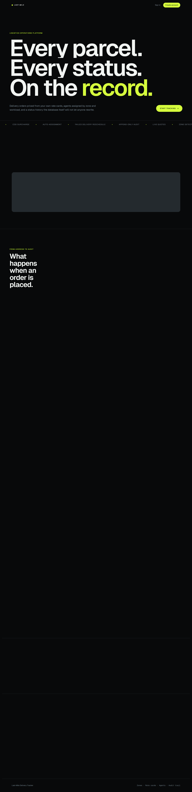

</td>
<td width="50%">

**Sign in**

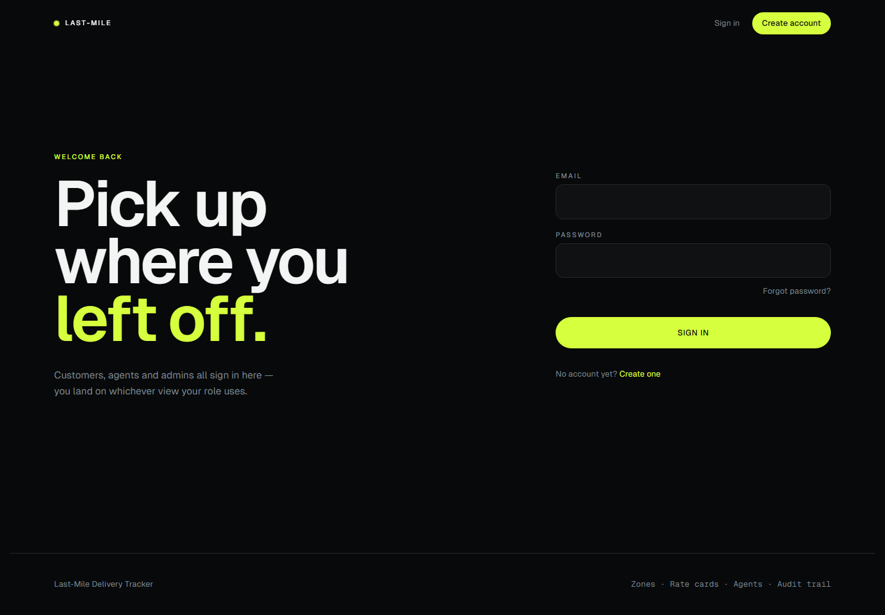

</td>
</tr>
<tr>
<td width="50%">

**Register**

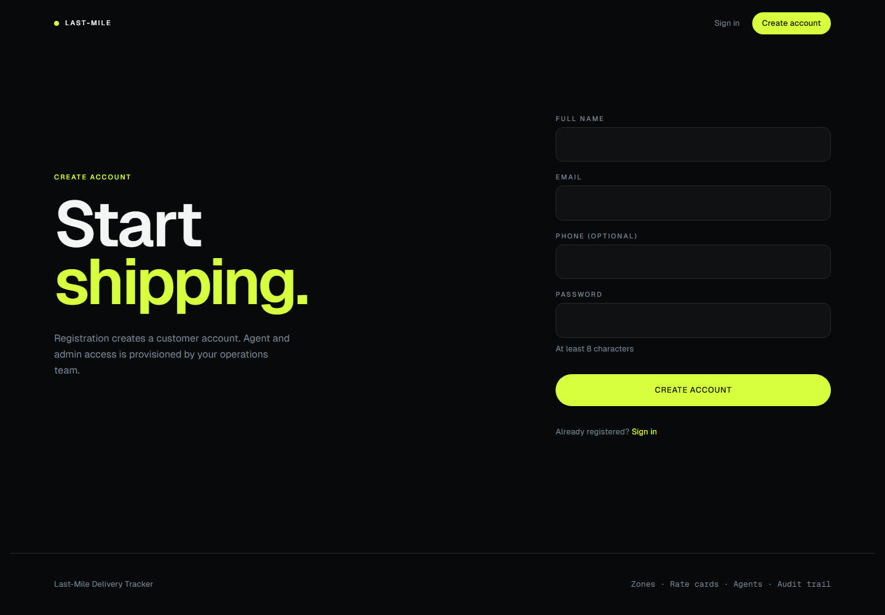

</td>
<td width="50%">

**New order — live quote**, fully resolved to a real price, not mid-request

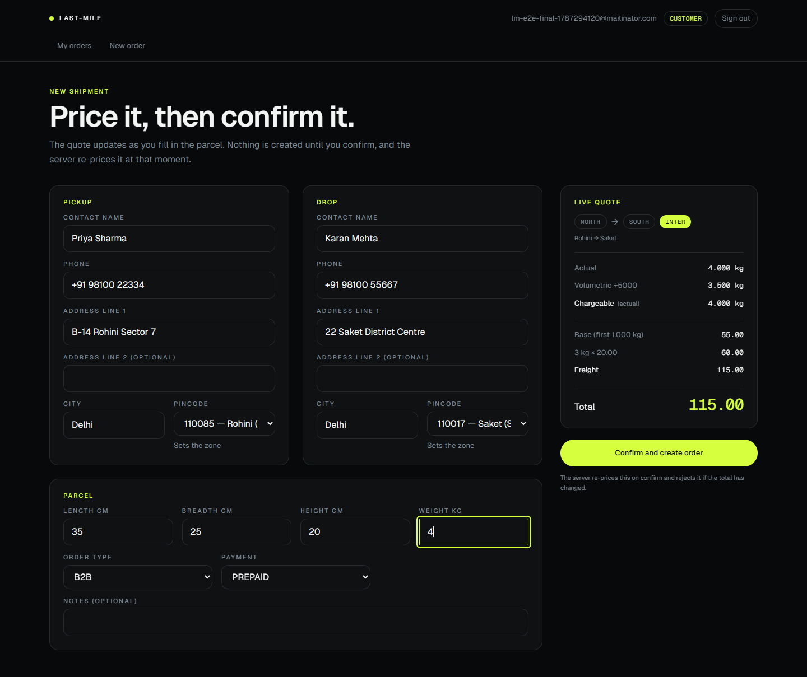

</td>
</tr>
<tr>
<td width="50%">

**Your orders**

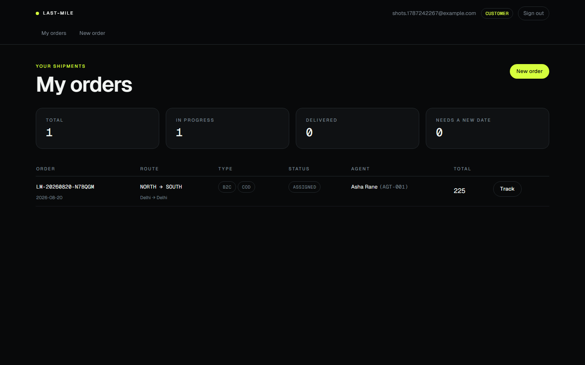

</td>
<td width="50%">

**Order tracking** — the full status history, not a summary

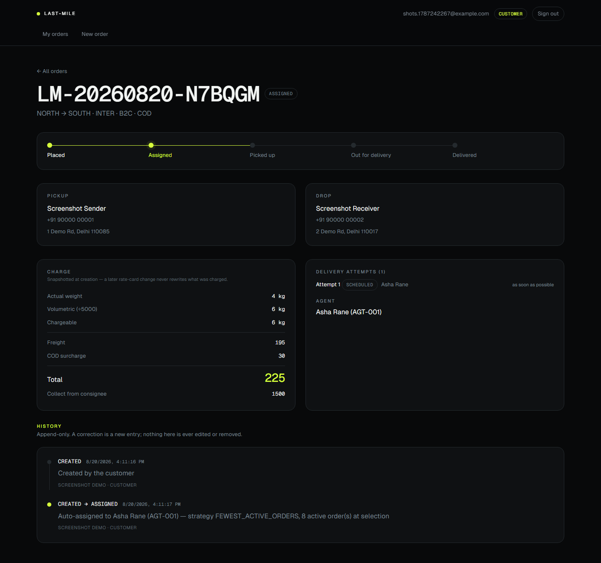

</td>
</tr>
<tr>
<td width="50%">

**Admin overview** — pricing coverage across zones

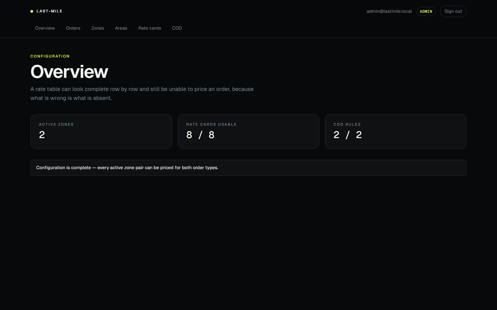

</td>
<td width="50%">

**Admin — zones**

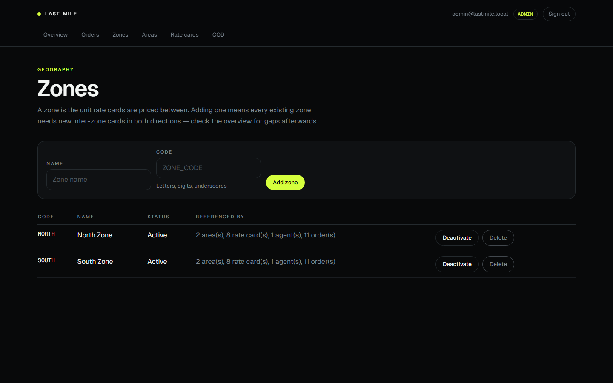

</td>
</tr>
<tr>
<td width="50%">

**Admin — rate cards**, editable live

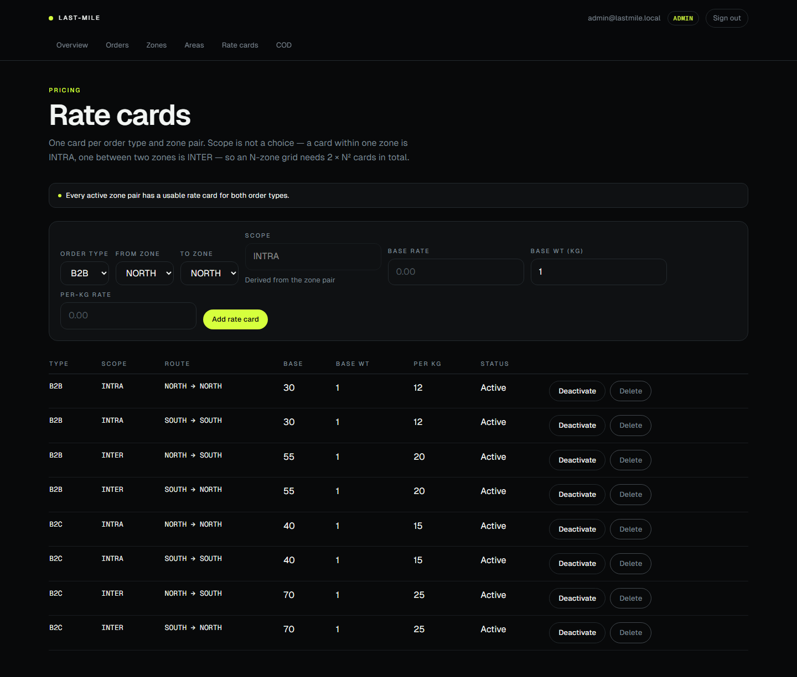

</td>
<td width="50%">

**Admin — orders**, filter by status/zone/agent, manual assign or override

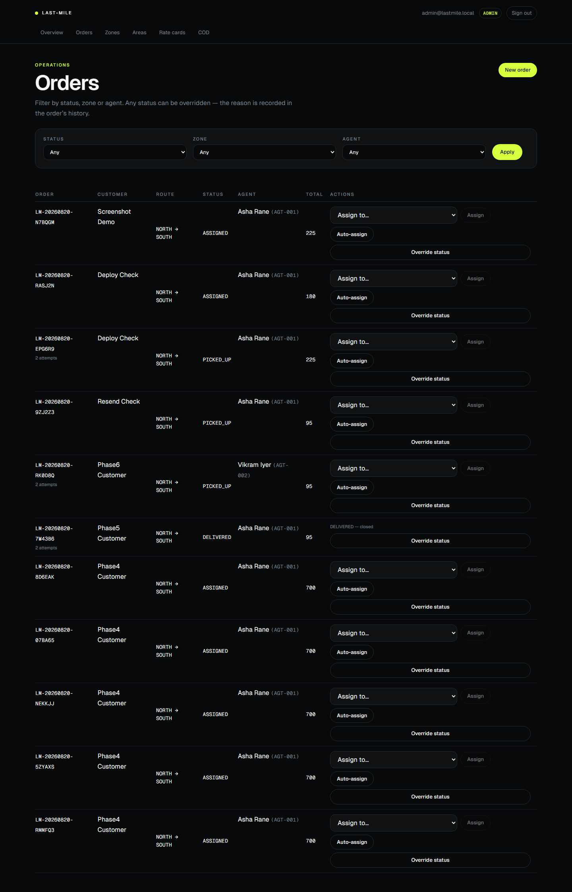

</td>
</tr>
<tr>
<td width="50%">

**Agent workload**

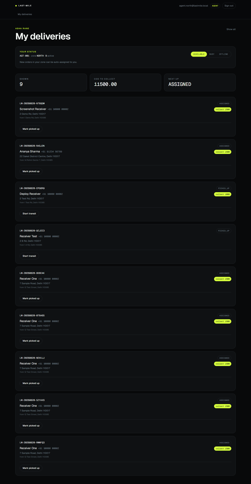

</td>
<td width="50%">

**Mobile — new order**, same live quote, single column

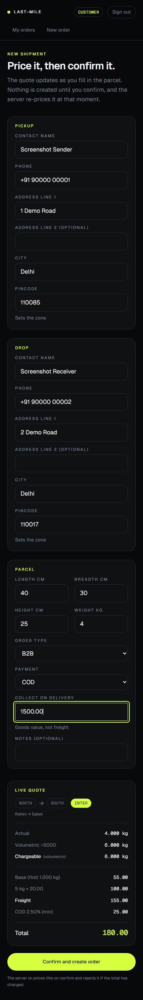

</td>
</tr>
</table>

### Proof that email actually sends

Register with your own inbox above, or use "forgot password" — the email
will arrive. This deployment sends through a real Gmail account over SMTP,
which has no restriction on who can receive mail, unlike a free-tier provider
sandbox that only reaches the account owner. There's no special inbox you
need access to.

The two screenshots below are the same evidence, captured earlier — not a
substitute for trying it, just there in case you'd rather not wait on mail.

<table>
<tr>
<td width="50%">

**Order confirmation** — order number, agent, tracking link

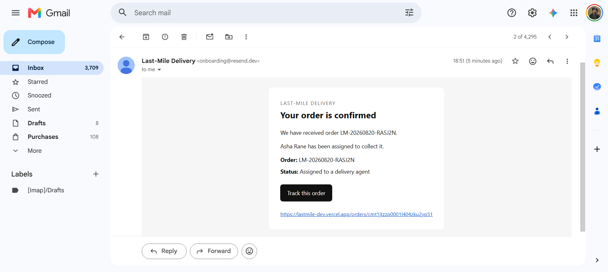

</td>
<td width="50%">

**Password reset** — one-hour link, single use

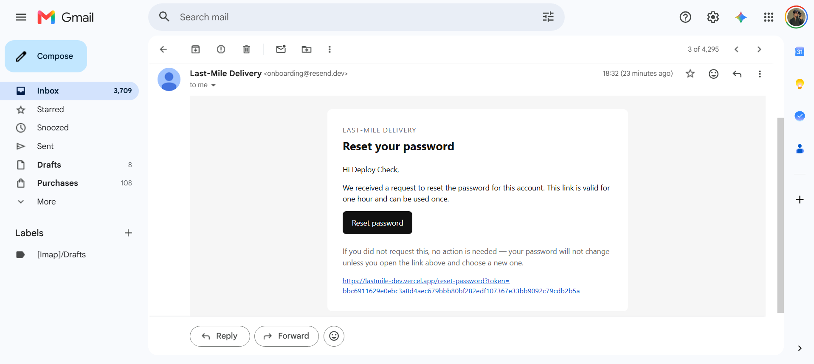

</td>
</tr>
</table>

You can also confirm it without checking an inbox: open devtools → Network
while advancing an order's status, and check the response for
`"notified": true`. That's only ever true when the email provider genuinely
accepted the message.

---

## Contents

- [For reviewers](#for-reviewers--start-here) — demo logins, walkthrough, screenshots
- [Getting started](#getting-started) — install, run, environment variables
- [Database schema](#database-schema)
- [How pricing works](#how-pricing-works) — the rate engine
- [Orders and status](#orders-and-status) — assignment, lifecycle, notifications
- [API reference](#api-reference)
- [Design notes](#design-notes)
- [Deployment](#deployment)

---

## Getting started

### Prerequisites

- Node.js 18.17+
- A PostgreSQL database (Neon's free tier works)
- A Gmail account + app password, if you want real email — optional, without it the app just logs the message instead of sending it

### Install and run

```bash
git clone https://github.com/devaskswhy/Last-Mile_DeliveryTracker-D7V-.git
cd Last-Mile_DeliveryTracker-D7V-

npm install                # postinstall runs `prisma generate`
cp .env.example .env       # then fill it in — see the table below

npm run db:migrate         # apply migrations
npm run db:seed            # zones, areas, rate cards, 1 admin, 2 agents
npm run dev                # http://localhost:3000
```

The seed requires `SEED_ADMIN_PASSWORD` and `SEED_AGENT_PASSWORD` and fails
without them, so there's never a working password sitting in the repo.

### Commands

```bash
npm run dev           # dev server
npm run build         # production build
npm start             # serve the production build
npm test              # Vitest -- rate engine + notification tests
npm run test:watch    # Vitest in watch mode
npm run db:migrate    # prisma migrate dev
npm run db:deploy     # prisma migrate deploy -- CI / production
npm run db:seed       # idempotent -- safe to re-run
npm run db:studio     # Prisma Studio
```

### Environment variables

Everything in `.env.example`. `.env` itself is gitignored and never committed.

| Variable | Required | What it's for |
| -------- | :------: | -------------- |
| `DATABASE_URL` | yes | Pooled Postgres connection, used at runtime |
| `DIRECT_URL` | yes | Unpooled connection, used only by Prisma Migrate |
| `JWT_SECRET` | yes | Session signing key, 32+ characters |
| `JWT_EXPIRES_IN` | no | Session lifetime in seconds (default 7 days) |
| `AUTH_COOKIE_NAME` | no | Session cookie name (default `lm_session`) |
| `SEED_ADMIN_EMAIL` | no | Default `admin@lastmile.local` |
| `SEED_ADMIN_PASSWORD` | seed only | Required to run `npm run db:seed` |
| `SEED_AGENT_PASSWORD` | seed only | Required to run `npm run db:seed` |
| `SMTP_HOST` | no | Default `smtp.gmail.com` — only change for a non-Gmail provider |
| `SMTP_PORT` | no | Default `587` |
| `SMTP_USER` | no | A Gmail address, for real email |
| `SMTP_PASS` | no | A 16-character [Gmail app password](https://myaccount.google.com/apppasswords) |
| `EMAIL_FROM_NAME` | no | Display name on outgoing mail |
| `NEXT_PUBLIC_APP_URL` | no | Set this in production, or emailed links point at localhost |

Generate a JWT secret with:

```bash
node -e "console.log(require('crypto').randomBytes(32).toString('hex'))"
```

---

## Database schema

`prisma/schema.prisma` is the single source of truth. Money and weight are
always `Decimal`, never `Float`.

| Model | What it holds |
| ----- | -------------- |
| **User** | One row per person — customer, agent or admin. Deactivated, not deleted, so past orders keep their actor references. |
| **Zone** | The unit rate cards are priced between, e.g. `NORTH`. |
| **Area** | Maps a pincode to exactly one zone — this is how an address finds its zone. |
| **RateCard** | Pricing for one `(order type, scope, from zone, to zone)`. Base rate for the first weight bracket, plus a per-kg rate beyond it. |
| **CodSurchargeConfig** | One row per order type — either a fixed amount or a percentage of the freight. |
| **Agent** | A delivery agent's profile: availability, current zone, current coordinates. |
| **Order** | The shipment: both addresses, dimensions, weights, resolved zones, and a snapshot of every charge — so a later rate change never rewrites history. |
| **DeliveryAttempt** | One scheduled attempt. A failure closes it; a reschedule opens the next. |
| **OrderStatusHistory** | Append-only. Every status change, with actor, role, timestamp and note. A Postgres trigger blocks UPDATE, DELETE and TRUNCATE — a correction is a new row, never an edit. |

Four migrations, applied in order: the initial schema, the append-only
trigger, a set of CHECK constraints on rate cards and COD rows, and the
delivery-attempts table.

---

## How pricing works

Nothing about pricing lives in code — no zone, no rate, no surcharge value.
Everything comes from the tables above, editable live at `/admin`.

```
volumetric weight = (L × B × H) ÷ 5000
chargeable weight = the higher of actual weight and volumetric weight
freight           = base rate + per-kg rate × (chargeable weight − base weight, rounded up)
COD surcharge     = a fixed amount, or a percentage of freight with a floor
total             = freight + COD surcharge
```

An address resolves to a zone through its pincode → area → zone. Two zones
means `INTER`, the same zone means `INTRA` — that's computed, never picked.

If a rate card or COD rule is missing for a combination, the quote fails
loudly with a clear error rather than silently charging zero or guessing.
`GET /api/admin/config-health` lists every gap across the whole table, and
the rate-cards screen can fill them all in at once.

The engine itself (`src/lib/rate-engine/`) is a small, pure function — same
inputs always give the same output, tested with plain objects, no database
involved. Money and weight are handled as whole-number counts (cents, grams)
rather than floats, specifically so rounding never quietly overcharges by a
few cents. See [SYSTEM_DESIGN.md](SYSTEM_DESIGN.md) for the full reasoning.

---

## Orders and status

**Creating an order.** The price shown to the customer is never trusted as
the price charged. The server recomputes it with the same rate engine the
quote used, and if the two disagree — a rate card changed in between, say —
the request is rejected rather than silently accepting a stale number.

**Assignment.** A new order goes to whichever eligible agent in the pickup
zone currently has the fewest active deliveries — not the nearest by GPS,
because an active-order count can't go stale the way a location ping can.
If nobody is free, the order sits unassigned until an admin assigns it
manually or re-runs the match.

**Status lifecycle:**

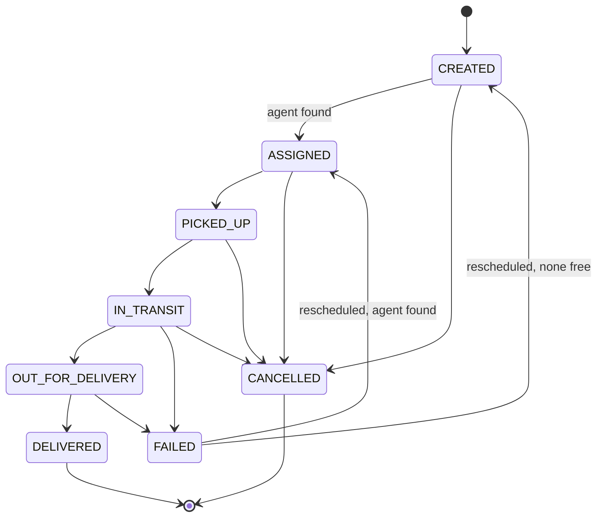

Only `DELIVERED` and `CANCELLED` are closed. `FAILED` isn't — a failed
delivery is exactly the point where the customer reschedules and the order
re-enters the pipeline, so treating it as final would block that. Agents can
only move an order forward or mark it failed; only an admin can cancel or
override. The full set of allowed moves lives in one place
(`src/lib/domain/order-status.ts`), so the UI can never offer a move the
server would reject.

**Notifications.** Every creation, status change, failure, reschedule and
reassignment sends a notification. Order code just calls one function and
doesn't know or care which channels exist:

- **Email** is real, via Gmail SMTP — see [above](#proof-that-email-actually-sends).
- **SMS is a stub.** It logs what it would have sent and reports itself as
  not delivered. No free SMS provider we could find will actually deliver to
  an unverified number, so shipping a "working" SMS channel that silently
  fails would be worse than being upfront that it's not wired up. Nothing in
  the UI or API ever claims a text was sent.

A notification failure can never fail the request that triggered it — by the
time it fires, the status change is already saved, so a flaky email provider
shouldn't make an agent retry something that already worked.

---

## API reference

Every route answers the same envelope shape:

```jsonc
{ "ok": true, "data": { /* ... */ } }
{ "ok": false, "error": { "message": "…", "details": { /* optional */ } } }
```

Sessions are an HS256 JWT in an httpOnly cookie. Middleware gates routes by
role; every handler then re-checks the session itself rather than trusting a
forwarded header.

| Status | Meaning |
| ------ | ------- |
| `401` | Not signed in, or the account was deactivated |
| `403` | Signed in, wrong role |
| `409` | Conflict — stale price, duplicate, closed order, no agent available |
| `422` | Validation failed, or a business rule rejected the request |

### Auth

| Method | Path | Access |
| ------ | ---- | ------ |
| POST | `/api/auth/register` | public — always creates a `CUSTOMER` |
| POST | `/api/auth/login` | public |
| POST | `/api/auth/logout` | public |
| POST | `/api/auth/forgot-password` | public — same response either way |
| POST | `/api/auth/reset-password` | public — needs a valid, unused, unexpired token |
| GET | `/api/me` | any signed-in role |

#### Password reset

`forgot-password` always replies the same way, whether or not the address is
registered — that's on purpose, so nobody can use it to check which emails
have an account. The link it emails carries a token that's stored as a
SHA-256 hash (not the raw token), expires in one hour, and can only be used
once.

### Orders

| Method | Path | Access |
| ------ | ---- | ------ |
| POST | `/api/orders/quote` | any signed-in role — read-only, prices without creating anything |
| GET | `/api/areas` | any signed-in role — serviceable pincodes, for the order-form picker |
| POST | `/api/orders` | customer (own) or admin (on behalf) |
| GET | `/api/orders` | scoped — own orders, assigned orders, or everything, by role |
| GET | `/api/orders/[id]` | owner, assigned agent, or admin |
| GET | `/api/orders/[id]/tracking` | owner, assigned agent, or admin — full status history |
| POST | `/api/orders/[id]/reschedule` | order owner or admin |

### Agent

| Method | Path | Access |
| ------ | ---- | ------ |
| GET | `/api/agent/orders` | agent's own workload |
| POST | `/api/agent/orders/[id]/status` | agent, own orders only |
| PATCH | `/api/agent/availability` | agent's own availability |

### Admin

| Method | Path | Purpose |
| ------ | ---- | ------- |
| GET / POST | `/api/admin/zones` | list / create zones |
| GET / PATCH / DELETE | `/api/admin/zones/[id]` | read / update / delete a zone |
| GET / POST | `/api/admin/areas` | list / create areas |
| GET / PATCH / DELETE | `/api/admin/areas/[id]` | read / update / delete an area |
| GET / POST | `/api/admin/rate-cards` | list / create rate cards |
| GET / PATCH / DELETE | `/api/admin/rate-cards/[id]` | read / update / delete a rate card |
| POST | `/api/admin/rate-cards/bulk` | create many at once |
| GET / PUT | `/api/admin/cod-surcharges` | list / upsert by order type |
| GET | `/api/admin/config-health` | pricing coverage gaps |
| POST | `/api/admin/orders/[id]/assign` | manual or auto (re)assignment |
| POST | `/api/admin/orders/[id]/status` | override, with a required reason |
| GET | `/api/admin/agents` | agents with live workload |
| GET | `/api/admin/customers?q=` | customer search |

Deleting a zone or rate card that's still in use is refused (409) rather than
cascaded — deactivate it instead. Orders keep a snapshot of the rate card
that priced them, so deleting a used card would destroy that record.

<details>
<summary>Example requests and responses</summary>

**Quote a shipment:**

```bash
curl -b jar.txt -X POST http://localhost:3000/api/orders/quote \
  -H 'Content-Type: application/json' \
  -d '{"pickupPincode":"110085","dropPincode":"110017","lengthCm":"40","breadthCm":"30","heightCm":"25","actualWeightKg":"4","orderType":"B2C","paymentType":"COD"}'
```

```jsonc
{ "ok": true, "data": { "quote": {
  "pickupZone": { "code": "NORTH", "resolvedArea": { "name": "Rohini", "pincode": "110085" } },
  "dropZone": { "code": "SOUTH", "resolvedArea": { "name": "Saket", "pincode": "110017" } },
  "scope": "INTER",
  "chargeableWeight": "6.000", "chargeableWeightBasis": "VOLUMETRIC",
  "freightBreakdown": { "baseRate": "70.00", "billedExcessKg": 5, "perKgRate": "25.00", "excessCharge": "125.00" },
  "codBreakdown": { "mode": "FIXED", "amount": "30.00" },
  "totalCharge": "225.00"
} } }
```

**Create an order** (the same shape, plus contact details and
`acknowledgedTotal` — the price the customer was shown, checked against the
server's own calculation, never used as the actual charge):

```jsonc
{ "ok": true, "data": {
  "orderNumber": "LM-20260820-5ZYAXS",
  "assignment": { "assigned": true, "agentName": "Asha Rane", "employeeCode": "AGT-001" }
} }
// 409 QUOTE_STALE if the price changed between quote and confirm
```

**Update status as an agent:**

```jsonc
// request: { "status": "FAILED", "note": "Nobody at the address; building locked" }
{ "ok": true, "data": { "previousStatus": "OUT_FOR_DELIVERY", "status": "FAILED", "notified": true } }
```

All money and weight values are decimal **strings**, never JSON numbers.

</details>

---

## Design notes

The public pages (landing, sign in, register) run a dark, high-contrast look.
Everything behind login follows the visitor's OS theme instead. There's one
accent color throughout (a hi-vis lime, `#D6FF3D`) and one easing curve for
every animation — no competing motion styles, no second hue standing in for
"success" or "danger." Reduced-motion preferences are respected: scroll
effects and hero animation are skipped entirely rather than just shortened.

---

## Deployment

Standard Next.js 14 App Router project — no adapter, no custom build step.

### Vercel

1. Import the repo at [vercel.com/new](https://vercel.com/new). Framework
   preset is detected automatically.
2. Set these environment variables under **Settings → Environment
   Variables**:

   | Variable | Value |
   | -------- | ----- |
   | `DATABASE_URL` | Neon pooled connection string |
   | `DIRECT_URL` | Same host, without `-pooler` |
   | `JWT_SECRET` | A fresh 32+ character secret |
   | `NEXT_PUBLIC_APP_URL` | `https://<your-deployment>.vercel.app` |
   | `SMTP_USER` / `SMTP_PASS` | Gmail address + app password, for real email |
   | `EMAIL_FROM_NAME` | `Last-Mile Delivery` |

3. Run migrations once against production:

   ```bash
   DIRECT_URL="<production direct url>" npx prisma migrate deploy
   ```

4. Seed it:

   ```bash
   DATABASE_URL="…" DIRECT_URL="…" SEED_ADMIN_PASSWORD="…" SEED_AGENT_PASSWORD="…" npm run db:seed
   ```

5. Check it end to end: register, place an order, watch the price resolve,
   confirm it, sign in as admin and agent, and confirm the email arrived.

Render and Railway work the same way — Node build, `npm run build`, start
with `npm start`. The only hard requirements are the two Postgres URLs and
`JWT_SECRET`.
